# 14 - Build a Canvas Power App that uses a Custom Connector to Pull Data

__This guide is part of the [Azure Pet Store App Dev Reference Guide](../README.md)__

In this section we'll look at how to develop an a Power App that consumes data from the Azure Function App that was built in the previous guide.

> 📝 **Please Note, we assume you have completed the [Configure Apps to use Application Insights](../08-configure-apps-to-use-application-insights/README.md) guide and have a working Application Insights service that can be used by this Azure Function App.**

> 📝 **Please Note, we assume you have completed the [Build and Deploy Azure Functions](../13-build-deploy-azure-functions/README.md) guide and have a working Azure Function App that retrieves petStoreCurrentSessionTelemetry.**

Head over to https://powerapps.microsoft.com/ and sign in and selct the Home icon from the left navigation.

You should see the following:
  


Before we create our Canvas  Power App, we are going to configure our Custom Data Connector. (It is possible to create the connectors at any point in time, for the sake of this guide, I decided to get the data integration implemented first)

Select Custom Connectors and then Select New custom connector (Create from blank)

You should see the following:
  


Give your Connector a name *(I'm using "Azure Pet Store Functions", this is the name of your app and how it will appear to your users.)* And select "Continue"

You should see the following:
  


Let's define all of the Meta-Data for our Custom Connector. (You can also import a Swagger definition if you already have one). Fill out the **1. General** tab here. I'm keeping the defaults and entering my function app url endpoint domain and the base url.

You should see the following:
  
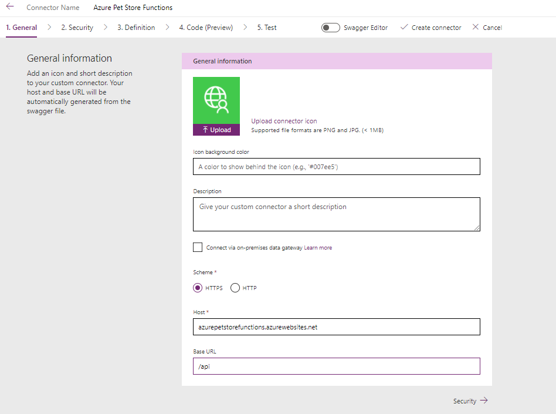

Fill out the **2. Security** tab here. We won't be applying anything for now, keep the defaults of no authentication.

You should see the following:
  


Fill out the **3. Definition** tab here. This is where we can define all of our Custom Connector operations. These are the mappings to our Azure Function App HTTP Triggers, think of this as a proxy to our Azure Function App, proxies to your HTTP endpoints (GET's POST's etc...). Fill out the Summary, Description and Operation ID. Operation ID is the important one here. This is how we will invoke our Custom Connector Operation from the Canvas Power App we build shortly.

Select Request to define our incoming GET Request Payload. Our Azure Function App has an HTTP Trigger on GET Request(s) that expects an apiKey an minsAgo query string parameters, so we will define those here. Select the HTTP Verb "GET" and paste in your Azure Function App operation and query string. The Custom Connector will automagically interpret this for us and generate a dynamic payload for us to work off of. Click import.

You should see the following:


  
Select the minsAgo Request Parameter button to edit this properties of this incoming Request Parameter. This allows us to specify default values, useful for scenarios where our Canvas Power App does not need to consistently pass these Request Parameters (static vs dynamic, perhaps when the App Loads you want to pull data but then allow user's to customize and change the values)


Select the apiKey Request Parameter button to edit this properties of this incoming Request Parameter. You can paste in your apiKey value here (if your expecting in your Azure Function App)

You should see the following:
  
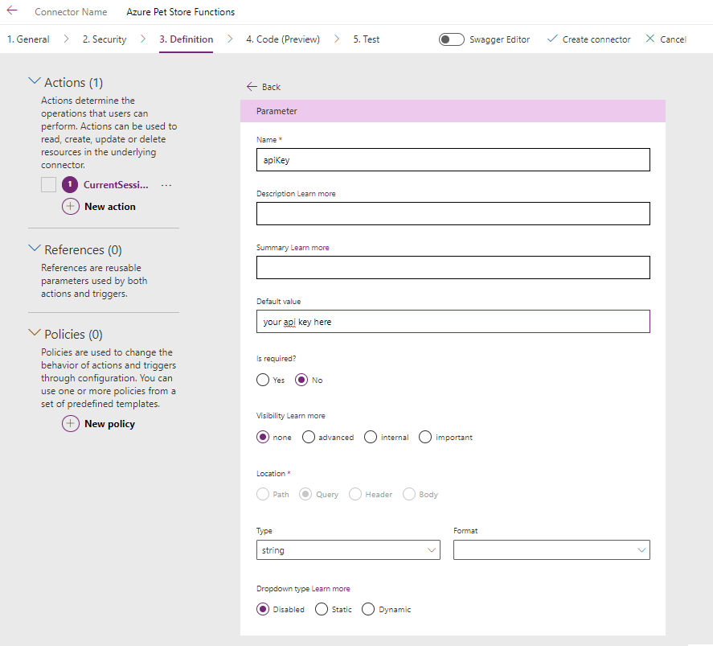

Let's now change the Response Body, this is where we can inform our Custom Connector on what data to interpret/consume after invoking the Azure Function App. Select + Import From Sample. Just as we did with the Request, we can paste in a sample response. 

You should see the following:
  


You should see the following:
  


Paste in your response Body and select "Import".

```json
{
   "sessions":[
      {
         "sessionId":"46F7644822E91895B064B832B1FE5066",
         "sessionBrowser":"safari",
         "sessionState":"Virginia",
         "sessionPageHits":3
      },
      {
         "sessionId":"2C0D4891181DABD6347F2261582CEE43",
         "sessionBrowser":"chrome",
         "sessionState":"Virginia",
         "sessionPageHits":1
      },
      {
         "sessionId":"7CE74D2DA51F322E1BA1FC9CD24A1859",
         "sessionBrowser":"chrome",
         "sessionState":"Virginia",
         "sessionPageHits":1
      },
      {
         "sessionId":"E7F48A5A8A161440FDAFA273A428A059",
         "sessionBrowser":"edge",
         "sessionState":"Virginia",
         "sessionPageHits":1
      },
      {
         "sessionId":"8CE30D0C168E810962AC983CFC36AB95",
         "sessionBrowser":"firefox",
         "sessionState":"Virginia",
         "sessionPageHits":1
      }
   ],
   "sessionCount":5
}
```

You will notice all of the field keys from our JSON response that will now be available from our Canvas Power App.

You should see the following:
  
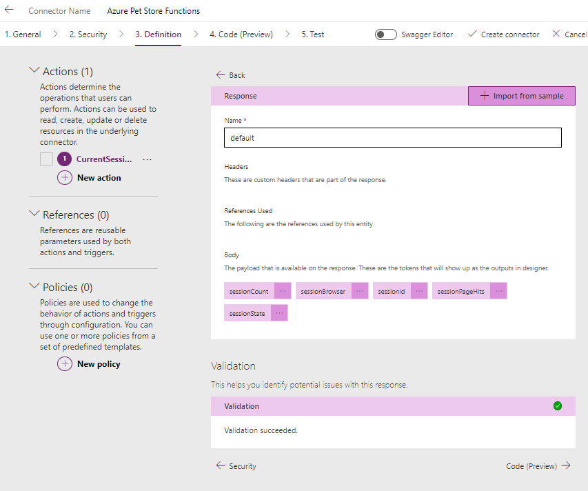

Select the Code (Preview)
The defaults are fine here, we will not be doing any custom transformations as we did that within the Function App.

You should see the following:
  


Select Test (Before we Test we will need to create the connector, which is the integration needed by our Canvas Power App to communicate with our Custom Connector)

You should see the following:
  


Select Create Connector and give it a name.

You should see the following:
  


Update the minsAgo and apiKey as desired and  Update connector as you make any changes.

You should see the following:
  


Head back to the Left Navigation and Select Connections to view your new Connection.

You should see the following:
  
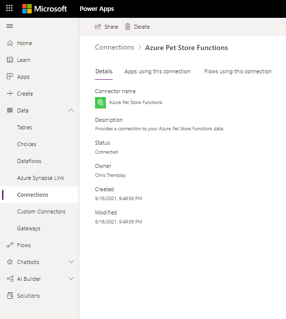

This is where you can Administer your connector. Perhaps you will need to make request/response changes over time etc... You can Test your Connections from here. Let's go ahead and click the Pencil to Edit/Test.

You should see the following:
  


Update Request Parameters to your Operation as needed and select "Test Operation" You should see the HTTP Response to your Azure Function App.

You should see the following:
  
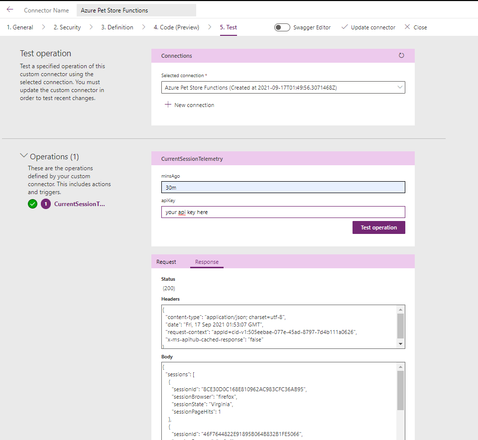

Let''s now build our Canvas Power App. From the left navigation select Apps followed by + New app > Canvas

You should see the following:
  


Give your Canvas app a name, and select Tablet or Phone. and Create. I'm using Phone.

You should see the following:
  


Before we do any visual design, let's add our data source (remember we are getting our data from our Connection to our Custom Connector) Select the data icon and Add data, locate your Connector and select it.

You should see the following:
  
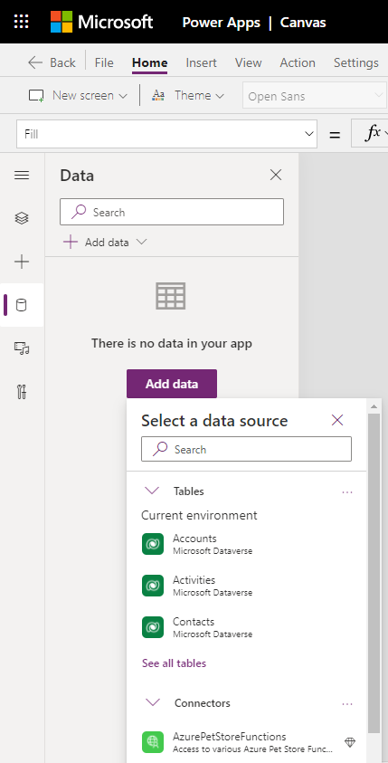

It should now be present and usable. We will verify that shortly.

You should see the following:
  


If you click the Connector is will prompt you to Allow for access.

You should see the following:
  
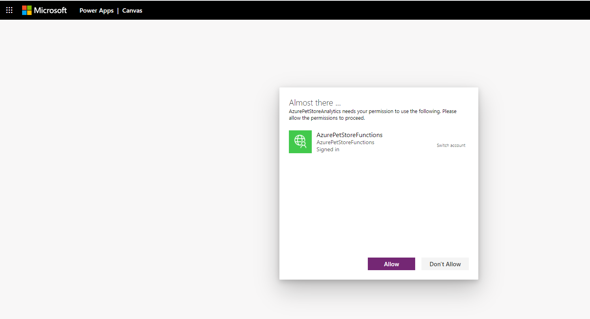

Back in our Canvas App Design, let's go ahead and select the Button component and one will get automagically added to our canvas. Under the f(x) we can add an Excel like formula to push/pull data from our Connector. Lets go ahead and add the following:

```
UpdateContext({sessionsResponse:AzurePetStoreFunctions.CurrentSessionTelemetry({minsAgo:"30m"})});
ClearCollect(userSessions,sessionsResponse.sessions);
UpdateContext({sessionCount:sessionsResponse.sessionCount});
```
This will set some variables for us. It will set a variable called "sessionsResponse" that has the json response from our  CurrentSessionTelemetry Operation belonging to our AzurePetStoreFunctions Connector. We can also pass in request arguments (if we do not want to use the default's). This will also set a variable for us called userSessions and sessionCount, both with values corresponding to their respective json values.

You should see the following:
  
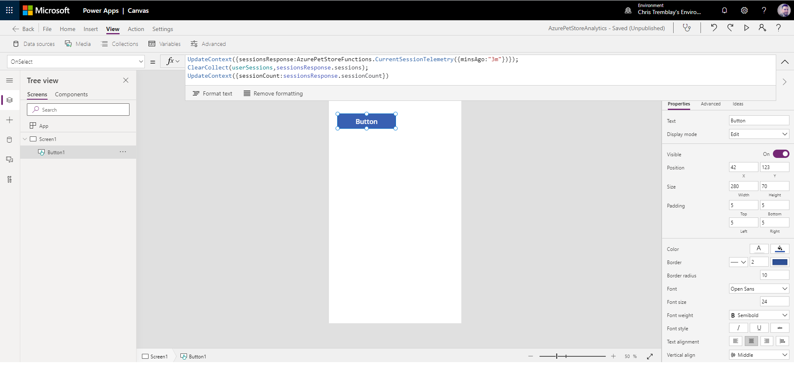

Let's ensure that on button click (You can click the button while holding the alt button to Test your app from Design view) is pulling data. Select View > Collections, the JSON data should be appearing here.

You should see the following:
  


Now let's make this UI a bit more presentable. Select Image and locate an image from disk, I am using https://github.com/chtrembl/azure-cloud/blob/main/petstore/14-build-power-apps/images/header.png for my Header.
You should see the following:
  


To display the current Live User Count from https://azurepetstore.com I've decided to display that count total (remember we have the "sessionCount" variable containing this) inside a circle. Select Shapes > Circle and center and design as you like. 

You should see the following:
  
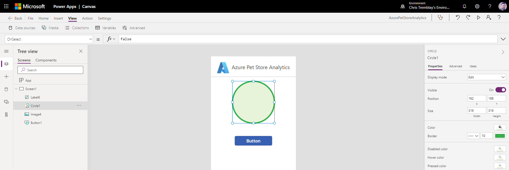

Add a Text Label on top of the circle. This will contain our dynamic count for us, design it as you like. 

Select the f(x) and remove the default and set the Excel like formula to 

```
sessionCount
```
After clicking the button (hold alt and click) you should see the count.

You should see the following:
  
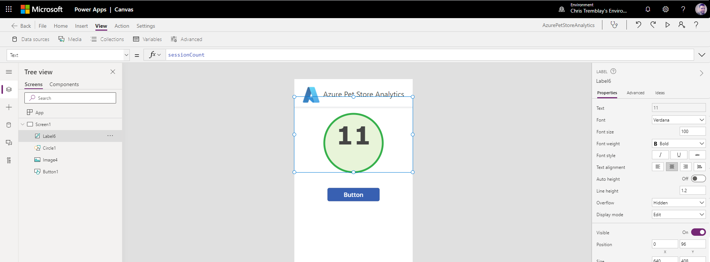

Add another Text Label for "Live Users" and design it as you like.

You should see the following:
  


Last but not least let's add a Vertical Gallery to display our Session Hits. Select Gallery and locate your Data Source (This will be the userSessions variable that our Excel like formula has created for us)

You should see the following:
  
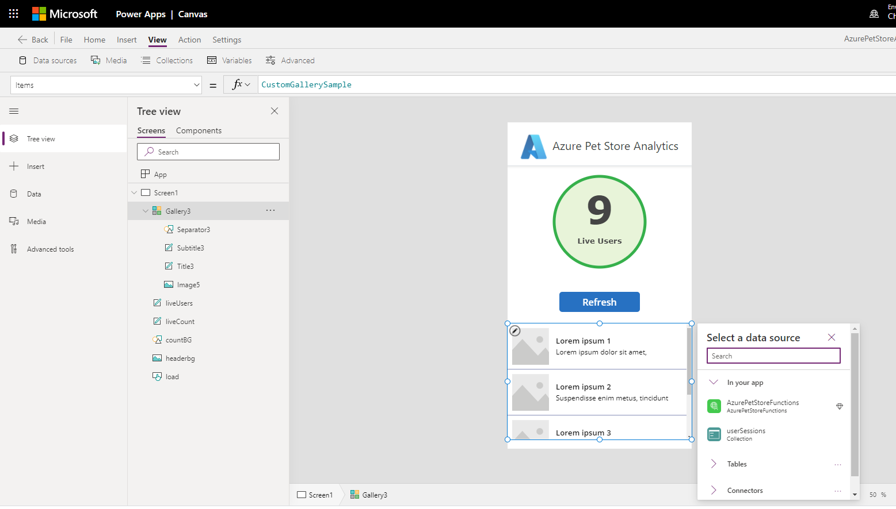

Position your Gallery as you like and update the Fields to dynamically present each record from our userSessions collection (JSON Function App Response) For image I am using "unknown-person" and for the labels I am displaying sessionId and sessionPageHits. You can add/remove more fields/labels as you like.

You should see the following:
  


Test this out to see if its working (hold alt and click the button)

You should see the following:
  


You can then make it a little more informative by showing the browser icon of the session hit along with the location etc... You can design this however you want!  You can even dynamically load the images based on browser (These are fields in the Custom Connector HTTP JSON Response). 

There are images for the common browsers

https://github.com/chtrembl/azure-cloud/blob/main/petstore/14-build-power-apps/images/chrome.png

https://github.com/chtrembl/azure-cloud/blob/main/petstore/14-build-power-apps/images/edge.png

https://github.com/chtrembl/azure-cloud/blob/main/petstore/14-build-power-apps/images/firefox.png

https://github.com/chtrembl/azure-cloud/blob/main/petstore/14-build-power-apps/images/opera.png

https://github.com/chtrembl/azure-cloud/blob/main/petstore/14-build-power-apps/images/safari.png

You can update the f(x) to dynamically load the image for each Verical Gallery row. (As long as you have added these images to your Canvas Power App, just like you did with the header image, they will be available to use)

```

If(ThisItem.sessionBrowser="firefox", firefox, ThisItem.sessionBrowser="chrome", chrome, ThisItem.sessionBrowser="safari", safari, ThisItem.sessionBrowser="opera", opera, ThisItem.sessionBrowser="unknown", 'unknown-person')

```
You should see the following:
  


Now you are ready to Test your Canvas Power App by hitting Play!

You should see the following:
  
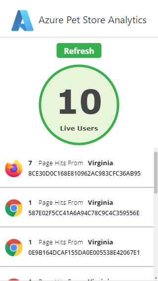


Things you can now do now with this guide

☑️ Build a Canvas Power App with Custom Connectors
